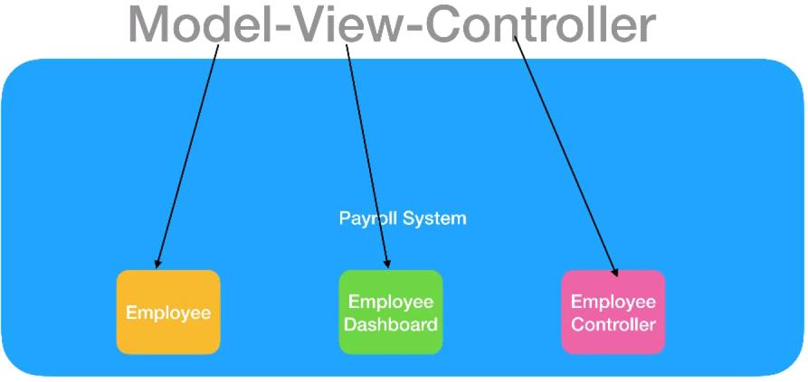
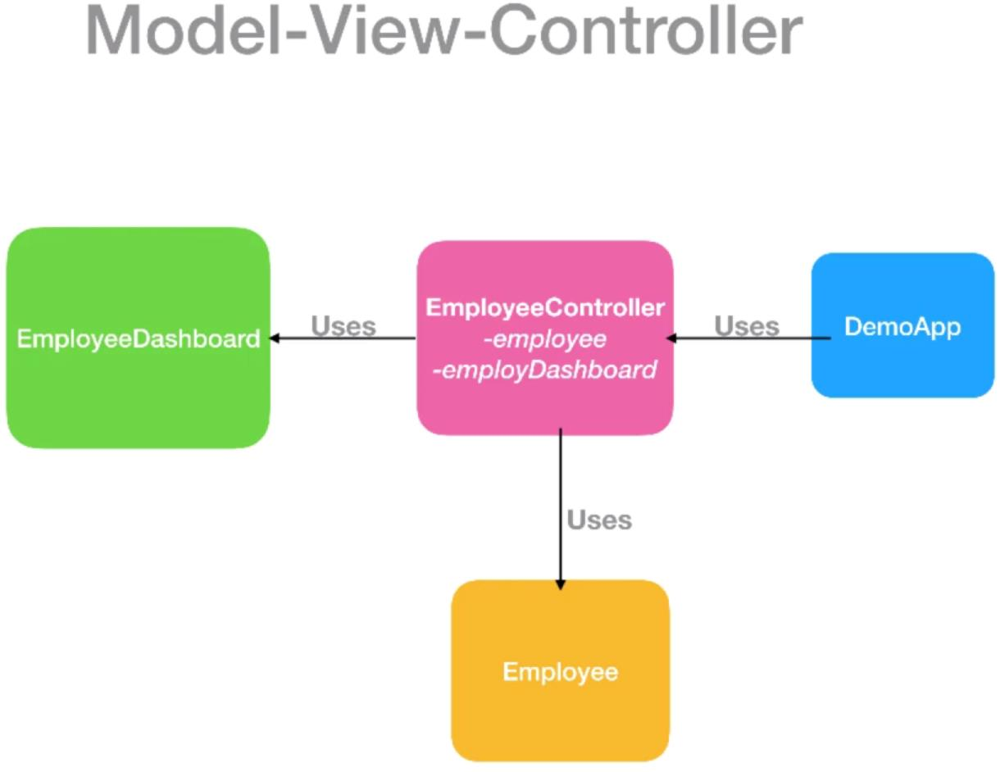

# Creating payroll system
[]
    A lot of components to build a system in place, e.g. Employee EmployeeDashboard, EmployeeController, ...
    The idea of MVC is look at the components that are compartmentalize or separating responsibilities (model/entiies, dashboard, controller ...)

    MVC will compartmentalize the code into a different categories:
    - Employee -> Model
    - EmployeeDashboard -> View that admin could use to manage the employees
    - EmployeeController -> Controller which act as a connector between the Employee model and EmployeeController.

> Controller has instance of Employee and EmployeeDashboard.

MVC uses other design patterns (compound design patterns!):
- EmployeeController & EmployeeDashboard are observers: they will be notified when the state change in the model
- EmployeeController & EmployeeDashboard  use the stategy design pattern: the EmployeeDashboard(view) delegates the controller to hanlde certain actions  and the controller need to know which actions need to be done 

as a reminder **strategy design pattern** allows us to create different algorithms/actions our classes at runtime.
[]