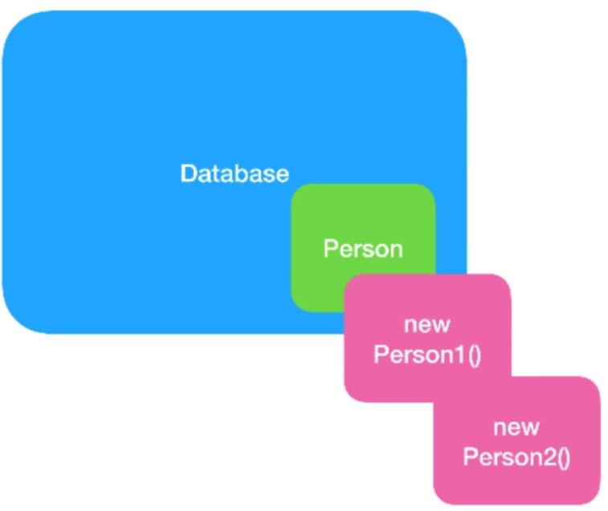
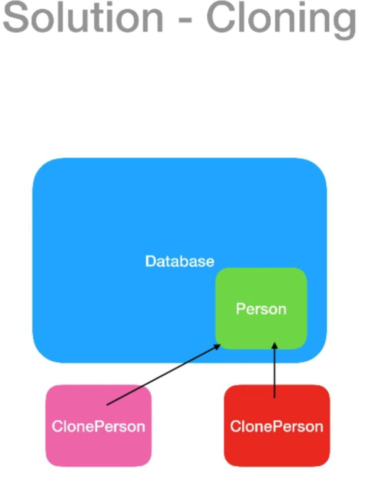

# Prototype design pattern
[]

	used when creating an instance of a given class is either exprensive or complicated

	- It's really exprensive to create an object 
	- also performing transactions on remote persistant DB object is exprensive

[]