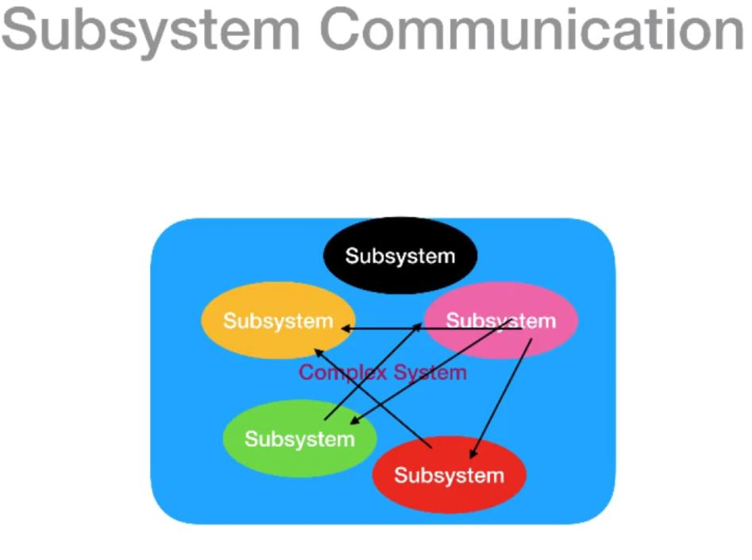
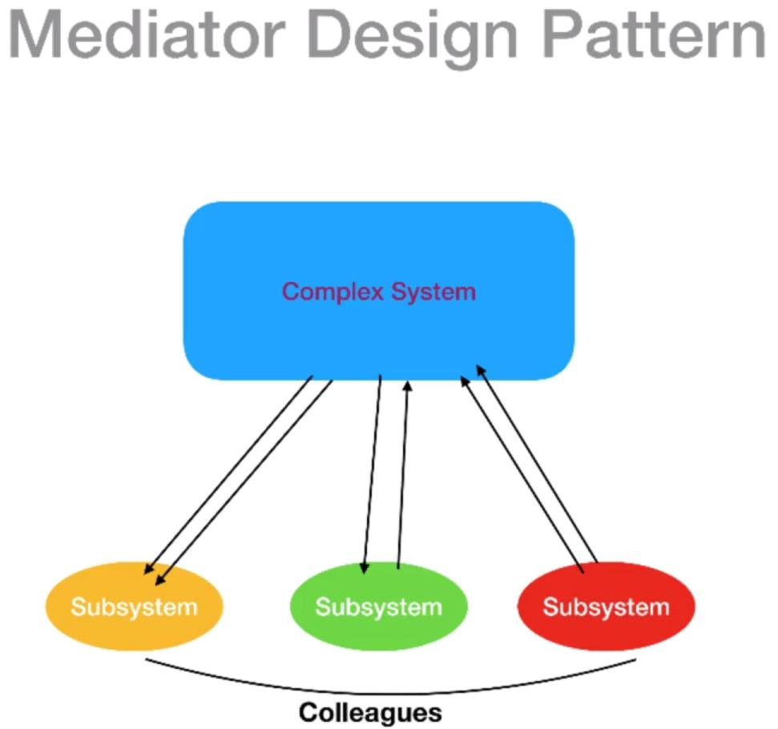

# Mediator design pattern
[]

	Centralizes complex communications and control between related object, such as a Complex system which contains subsystems

	- It will make sure that communications is centralized in one place (mediator = complex system, ATC and airplanes), thus minimize the communications between objects!
	- The subsystems (also called colleagues) doesn't have to know about each other's, they have to know how to communicate and receive information's from/to them to the mediator
	
	> through the mediator we loose coupling our classes (minimize the dependencies between classes), this should be the only reason for using mediator! (communications minimization!)
	> there is other to do loose coupling, as the number of mediator grows it becomes hard to maintain!

[]
