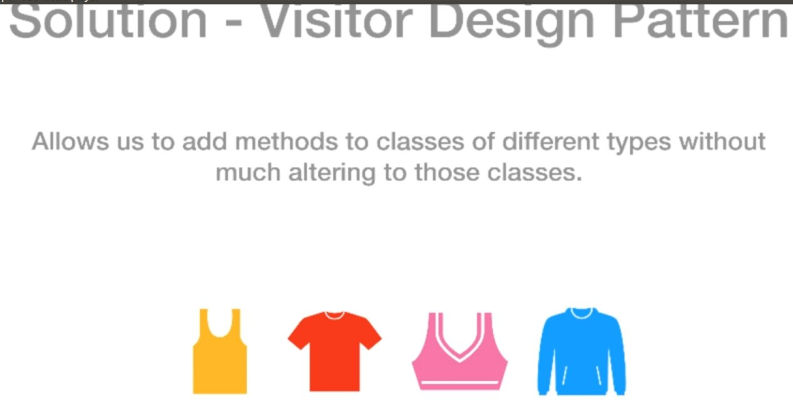

# Visitor design pattern
[]

	Allows us to add methods to classes of different types without musch altering the original classes.

	- Suppose we sell items such as Tshirt, shirt and Jacket, and need to get the final price after taxes, the obvious solution would be to add the tax structure in those classes (model)
	- the downsize is if the tax structure change we have to make changes to all our items which is not very handy!
	- Here when the visitor design pattern come to rescue.
	
	> we create a visitor interface which is attached to each individual item where the final price (tax incl.) calculations are done depending on the items type as opposed to do this calculation at each class level! 

[]
