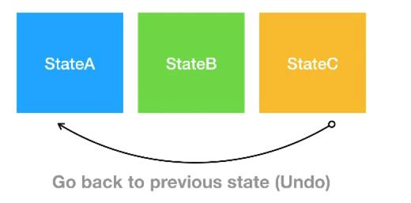
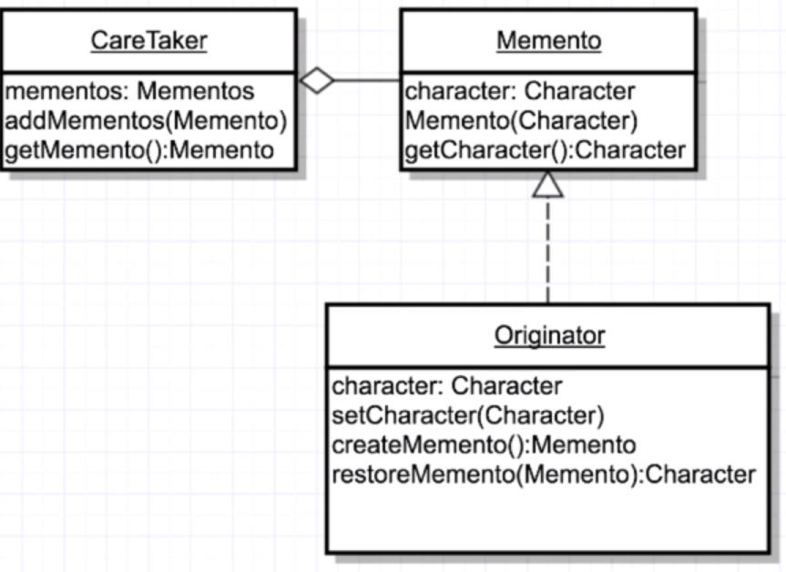

# Memento design pattern
[]

It covers the undoing of something, anything that changes a state and allows us to go back to the previous state
It returns an object to one of its previous states; if the user request an "undo".

	- Caretaker: Encapsulates Mementos (states freezer), it keeps track of multiple mementos so we can have different mementos, i.e. different states so when needed, we could allow users to go back to those states 
	- Originator: is the object for which the state is to be saved, it create a memento and use it in the future to undo. It will store the information in the memento object and it will also retrieve previous state when it needs to back track. 
	- Memento: is the object that will maintain the state of the originator, it stores what the oginator give to it. the memento object is unreachable/unvisible for the entire application otherwise theintegrity of the data saving will be compromise.
	

[] 
