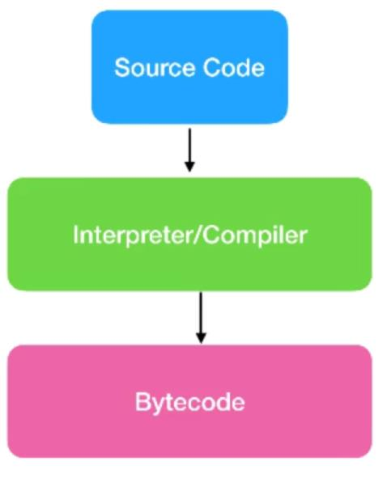
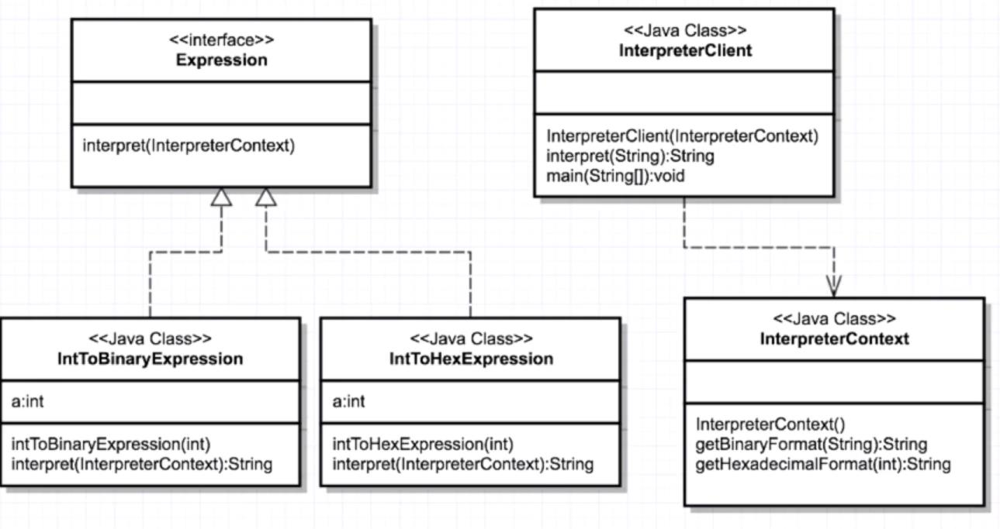

# Interpreter design pattern
[]

It's about interpreting some expression into something else such language interpreter. java use interpreter when it comes to generate the bycode
1- Source code
2- Interpreter/Compiler
3- Bytecode

[] 
