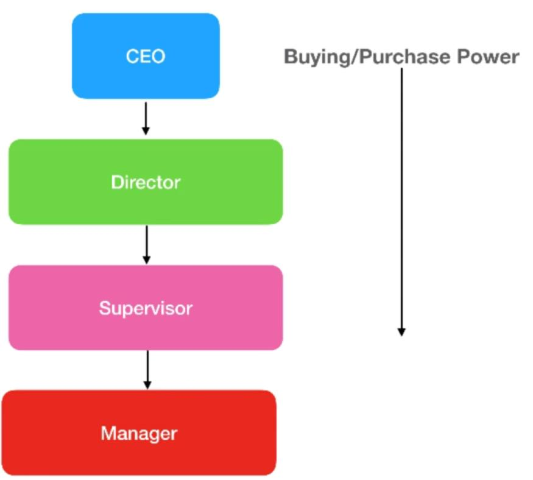
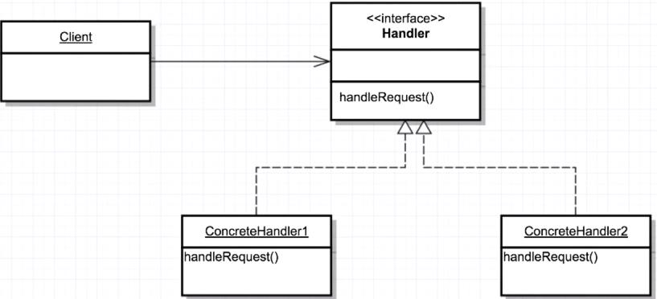

# Chain of responsability design pattern
[]
it uses when we give to more that one object a chance to handle a request. it's all about dividing responsabilities, to make sure that each request is handeled by a specific handler!

		Email Filtering example:
		- spam folder : spam filter handler
		- familly folder : familly filter handler
		- bussines folder : bussines filter handler
		...

		
[] 
