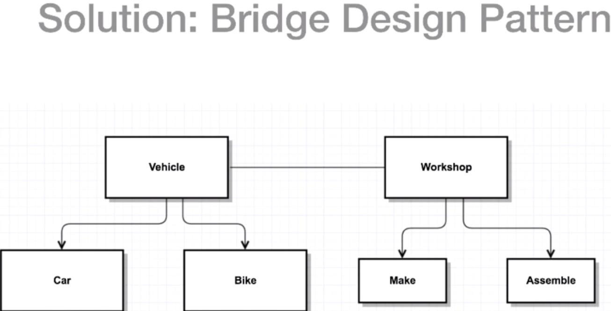

# Bridge design pattern
It allows us to separate the abstraction from the implementation.
	
[]
	Suppose that we make vehicles (cars or bikes), if we change anything on car or bike classes we need also to make change on "Make" and "Assemble"

[]
	Bridge design pattern allow us to restructure the previous diagram, now we have a decoupled correlation between vehicle and workshop, if anything change in one it doesn't necessarily affect the other. If a car change doesn't affect how it is made (creation or implementation).