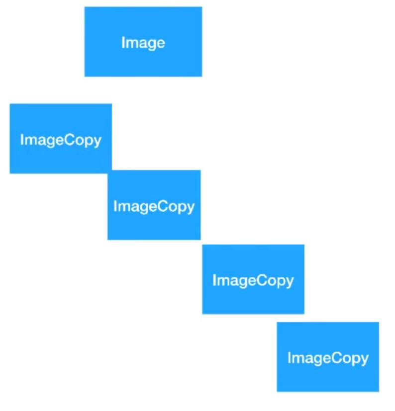

# FlyWeight design pattern
	
[]
	Suppose that we create a software that generates a lot of images in certain amout of time as in a fixed area. the onvious solution is to make a copy of the images and polpulate the area but this is really expensive and ineffcient.
	
	solution is to make many "virtual instances" of an image (FlyWeight design pattern). i.e. reuse existang instances if they already exist in memory!
	